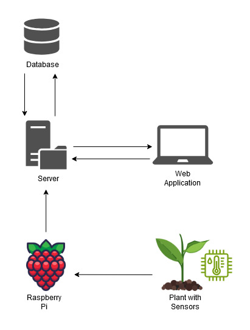

# README

## About PROJECT

PROJECT is an innovative solution designed to help you effortlessly manage the well-being of your
home plants. The system combines hardware and software to monitor environmental conditions and ensure your plants
receive the optimal care they need.

### Key Features

- **Sensor Integration**: Place a sensor in the pot of your plant to continuously monitor humidity levels, UV light
  exposure, and room temperature. These real-time metrics will be used to help you maintain a healthy plant
  environment.
- **User-Friendly Web App**: Access the PROJECT system via an intuitive web application. You can create your profile and
  after logging in, you can add new sensors to use and plants to monitor. You can choose the type of your plant from a
  selection and link it to its specific sensor, allowing for personalized monitoring.
- **Plant Monitoring Dashboard**: View detailed information about each of your plants, including current humidity, solar
  exposure, and room temperature. This data is presented in an easy-to-read format, helping you understand your plant's
  needs at a glance. If one of the metrics falls outside the optimal range, its related symbol will become red, alerting
  you to take action. You can also know the global health status of your plant in a glance thanks to a health indicator.
  The indicator is in the form of a smiley face that changes its expression based on the plant's health status.
- **Automated Notifications**: Stay informed with email notifications that alert you when a plant needs watering or has
  received sufficient sunlight for the day. These reminders help you maintain optimal care routines without
  constant manual checking.
- **Plant Information Database**: Explore a comprehensive database of general plant care information, accessible
  directly
  within the web app. This feature provides valuable insights and tips tailored to different plant types, helping you
  make informed decisions about plant care and maintenance.

PROJECT is the perfect companion for plant enthusiasts, offering a seamless and intelligent way to
ensure your plants thrive.

## Architecture and technical choices

### Web App

The web architecture of the PROJECT follows a classic frontend/backend model. Here's how the system is
structured:

- **Backend**: The backend is responsible for receiving data from the Raspberry Pi sensors and storing this information
  in a central database. It also handles requests from the frontend, processing and sending the necessary data for
  display.
  The backend is built using Node.js, with NestJS as the framework, and integrates JWT tokens for secure user
  authentication. Additionally, it uses SMTP protocols to send email notifications when a plant needs attention.
- **Frontend**: The frontend is developed using React and TypeScript, ensuring a responsive and dynamic user interface.
  Data
  is fetched from the backend using Axios and styled with Tailwind CSS. The entire frontend is hosted on Vercel,
  providing seamless deployment and scaling.

### Database

The database architecture is designed to keep the backend and database separate, which enhances security and
scalability. The database is self-hosted in a private server. (If time runs short, we will deploy our database in the
cloud.) The database itself is structured using SQL for efficient data management and retrieval.

- **Photo Storage**: For storing images associated with plants, Google Cloud Storage is used. This allows for robust and
  scalable image storage separate from the main database.

### Embedded System

The embedded system, powered by a Raspberry Pi, is responsible for collecting data from various sensors (humidity,
temperature, and UV light) and sending this information in JSON format to the backend.

- **Data Transmission**: The sensor data is sent in a JSON structure, where each reading (humidity, temperature,
  luminosity)
  is associated with a unique sensor ID. An additional security measure involves a basic POST request to verify the
  sensor's authenticity using its ID. The system might also include a response protocol, if time permits.
- **Hardware**: While a smaller Arduino could be considered for this role due to its lower power consumption, the
  Raspberry Pi is chosen for its greater processing power, which ensures reliable and efficient data handling.

This architecture ensures a robust, scalable, and user-friendly solution for monitoring and managing plant health.

### Diagram

## Workflow