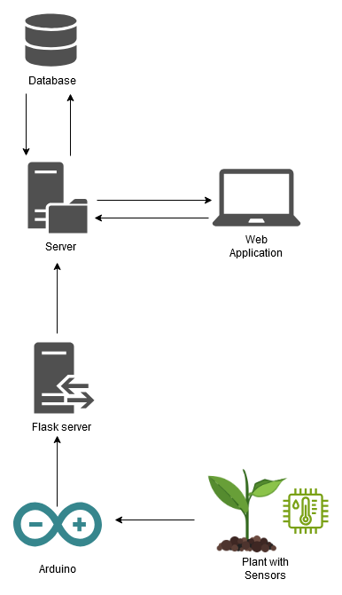

# README

## Contributors

Rafael Dousse, Eva Ray, Quentin Surdez, Rachel Tranchida

## About PlantKeeper

PlantKeeper is an innovative solution designed to help you effortlessly manage the well-being of your
home plants. The system combines hardware and software to monitor environmental conditions and ensure your plants
receive the optimal care they need.

### Key Features

- **Sensor Integration**: Place a sensor in the pot of your plant to continuously monitor humidity levels, UV light
  exposure, and room temperature. These real-time metrics will be used to help you maintain a healthy plant
  environment.
- **User-Friendly Web App**: Access the PlantKeeper system via an intuitive web application. You can create your profile
  and
  after logging in, you can add new sensors to use and plants to monitor. You can choose the type of your plant from a
  selection and link it to its specific sensor, allowing for personalized monitoring.
- **Plant Monitoring Dashboard**: View detailed information about each of your plants, including current humidity, solar
  exposure, and room temperature. This data is presented in an easy-to-read format, helping you understand your plant's
  needs at a glance. If one of the metrics falls outside the optimal range, its related symbol will become red, alerting
  you to take action. You can also know the global health status of your plant in a glance thanks to a health indicator.
  The indicator is in the form of a smiley face that changes its expression based on the plant's health status.
- **Automated Notifications**: Stay informed with email notifications that alert you when a plant needs watering or has
  received sufficient sunlight for the day. These reminders help you maintain optimal care routines without
  constant manual checking.
- **Plant Information Database**: Explore a comprehensive database of general plant care information, accessible
  directly
  within the web app. This feature provides valuable insights and tips tailored to different plant types, helping you
  make informed decisions about plant care and maintenance.

### Functional Requirements

- **Sensor Integration**:
  The system must allow users to connect and configure sensors for monitoring humidity levels, UV light exposure, and
  room temperature of individual plants.
  The system must continuously receive and store real-time data from sensors, including humidity, temperature, and UV
  light exposure, linked to specific plants.
- **User Authentication**:
  Users must be able to create a profile with unique login credentials (username and password) to securely access the
  web application.
  The system must allow users to log in and out of their profiles securely using authentication mechanisms such as JWT
  tokens.
- **Plant Management**:
  Users must be able to add new plants, select their type from a predefined list, and link them to specific sensors for
  personalized monitoring.
  The system must provide a dashboard displaying real-time metrics (humidity, solar exposure, temperature) for each
  plant.
- **Health Monitoring and Notifications**:
  The system must visually indicate if any metric (humidity, temperature, UV exposure) falls outside the optimal range
  by changing the related symbol to red.
  A health indicator in the form of a smiley face must dynamically change its expression based on the overall health
  status of each plant.
  The system must send automated email notifications to users when a plant requires watering or has received enough
  sunlight for the day.
- **Plant Information Database**:
  The system must provide access to a database containing general care information for various plant types.
  Users must be able to search and view plant care tips and guidelines within the web application.

### Non-Functional Requirements

- **Performance**:
  The system must be able to process and display sensor data in real-time with minimal latency.
  The web application must load the plant dashboard and respond to user interactions within 3 seconds.
- **Security**:
  User authentication must be secure, ensuring that unauthorized users cannot access personal profiles or sensitive
  data.
- **Usability**:
  The web application must have an intuitive user interface that allows users of all technical levels to easily
  navigate, add plants, and access sensor data.
  Visual indicators (like the smiley face health indicator) must be clear and easy to understand at a glance.
- **Reliability**:
  The system must be highly reliable, ensuring continuous monitoring and timely notifications.
  Email notifications must be sent accurately and within 10 minutes when plant conditions require attention.
- **Maintainability**:
  The system must be developed in a modular way, allowing for easy updates and maintenance, including the addition of
  new features or sensors.
  Code and documentation must be kept up-to-date to facilitate ongoing development and bug fixing.

PlantKeeper is the perfect companion for plant enthusiasts, offering a seamless and intelligent way to
ensure your plants thrive.

## Architecture and technical choices

### Web App

The web architecture of PlantKeeper follows a classic frontend/backend model. Here's how the system is
structured:

- **Backend**: The backend is responsible for receiving data from the Raspberry Pi sensors and storing this information
  in a central database. It also handles requests from the frontend, processing and sending the necessary data for
  display.
  The backend is built using Node.js, with NestJS as the framework, and integrates JWT tokens for secure user
  authentication. Additionally, it uses SMTP protocols to send email notifications when a plant needs attention.
- **Frontend**: The frontend is developed using React and TypeScript, ensuring a responsive and dynamic user interface.
  Data
  is fetched from the backend using Axios and styled with Tailwind CSS. The entire frontend is hosted on Vercel,
  providing seamless deployment and scaling.

### Database

The database architecture is designed to keep the backend and database separate, which enhances security and
scalability. The database is self-hosted in a private server. (If time runs short, we will deploy our database in the
cloud.) The database itself is structured using SQL for efficient data management and retrieval.

- **Photo Storage**: For storing images associated with plants, Google Cloud Storage is used. This allows for robust and
  scalable image storage separate from the main database.

### Embedded System

The embedded system, powered by an Arduino, is responsible for collecting data from various sensors (humidity,
temperature, and UV light) and sending this information in JSON format to the backend.

- **Data Transmission**: The sensor data is sent in a JSON structure, where each reading (humidity, temperature,
  luminosity)
  is associated with a unique sensor ID. An additional security measure involves a basic POST request to verify the
  sensor's authenticity using its ID. The system might also include a response protocol, if time permits.
- **Hardware**: The Arduino was chosen for its low power consumption and sufficient processing capabilities to handle
  the data collection tasks efficiently. While a Raspberry Pi was initially considered, issues with Python libraries for
  sensor integration led to the decision to use Arduino, ensuring reliable and efficient data handling.

This architecture ensures a robust, scalable, and user-friendly solution for monitoring and managing plant health.

### Diagram

## Team Workflow

The development of PlantKeeper is organized over a tight 3-week schedule, with a structured approach to task management
and
version control to ensure efficiency and collaboration. This workflow follows an Agile development methodology, allowing
the team to adapt and iterate quickly as the project progresses.

### Weekly and Daily Task Planning

At the beginning of each week, the team collectively decides on the tasks that need to be accomplished within that week.
This weekly planning sets the roadmap for our progress. Each day, during a brief stand-up meeting, the team reviews the
weekly tasks and selects the specific tasks to be tackled on that day. This iterative planning process is a key aspect
of Agile, providing flexibility to adjust priorities and focus on the most critical tasks.

### Task Tracking with Kanban

To keep track of the progress, we use a Kanban board integrated into our GitHub project. The Kanban board is divided
into four columns:

- **Backlog**: This column contains all the tasks that need to be completed but are not yet scheduled for the current
  week.
- **Tasks Current Week**: Tasks that have been prioritized for the current week are moved here from the backlog.
- **In Progress**: Once a team member starts working on a task, it is moved to this column to indicate active
  development.
- **Done**: After a task has been fully completed, it is moved to this column, signaling that it is ready for review or
  has
  already been integrated into the project.

This workflow allows us to visualize the status of each task and manage our time effectively, which is consistent with
Agile practices focused on transparency and continuous delivery.

### Git Workflow

Our version control process is designed to maintain code quality and ensure smooth integration:

1. **Creating Issues**: For every task, we create a corresponding issue in our GitHub repository. This issue tracks the
   progress and discussions related to that task.
2. **Branching and Development**: A new branch is created for each issue. The branch name typically references the issue
   number to maintain clarity. Development work is carried out in this branch, with all necessary commits made during
   the process.
3. **Pull Requests** (PRs): Once the feature or fix is ready, the branch is pushed to GitHub, automatically creating a
   Pull
   Request (PR). This PR is then reviewed by at least two other collaborators. This peer review process helps catch
   potential issues early and ensures that code quality standards are met.
4. **Approval and Merging**: The PR cannot be merged into the main branch until it has received approval from two
   collaborators. Additionally, the deployment process must succeed to ensure that the new code doesn’t break the
   application. Once these conditions are met, the branch is merged into the main branch, and the feature or fix becomes
   part of the project.

### Scrum methodology

Our development process is inspired by the Scrum methodology. We organize our work into weekly sprints, where we plan
and prioritize tasks at the beginning of each week, similar to Scrum's Sprint Planning. (Typically, the sprint is two
weeks long, but for this project, we have condensed it into one week to accommodate the
tight schedule.) The rest of our organization also aligns with Scrum practices.
Daily stand-up meetings help us align on the day’s
objectives, ensuring everyone is on the same page and any obstacles are quickly addressed. We track our progress using a
Kanban board, which allows us to visualize the flow of work and maintain transparency throughout the sprint. Each task
is developed in dedicated branches with peer-reviewed pull requests, ensuring high-quality, incremental delivery. By
adhering to Scrum, we are able to adapt quickly to changes and continuously improve our workflow, ultimately delivering
a more robust and effective project.

This workflow promotes collaboration, code quality, and stability throughout the development process, aligning with
Agile principles.